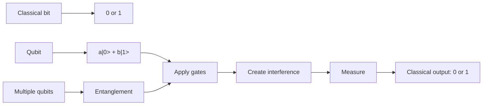

# Quantum Computing Basics Diagram

## How To Read It

- A classical bit is always one definite value: `0` or `1`.
- A qubit is described by a state such as `a|0> + b|1>`.
- Gates change the state of a qubit or several qubits.
- Entanglement appears when multiple qubits must be described together.
- Interference is what helps a quantum algorithm emphasize useful answers.
- Measurement turns the quantum state into an ordinary classical result.
